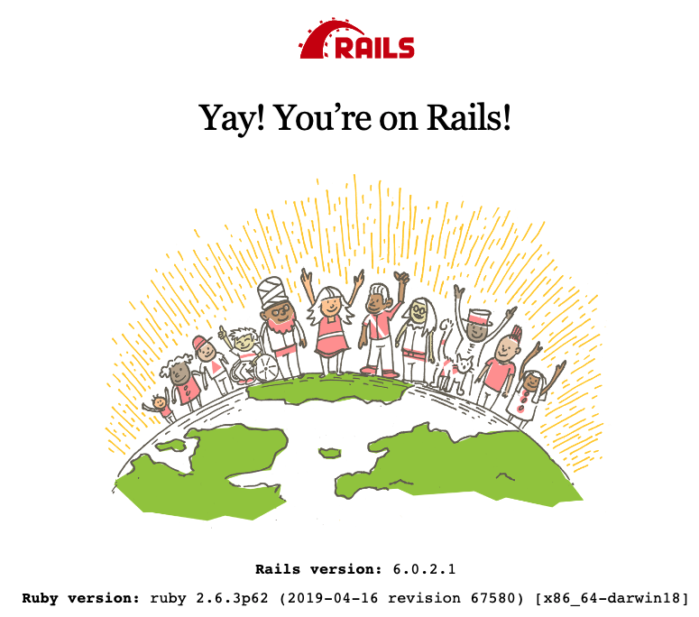
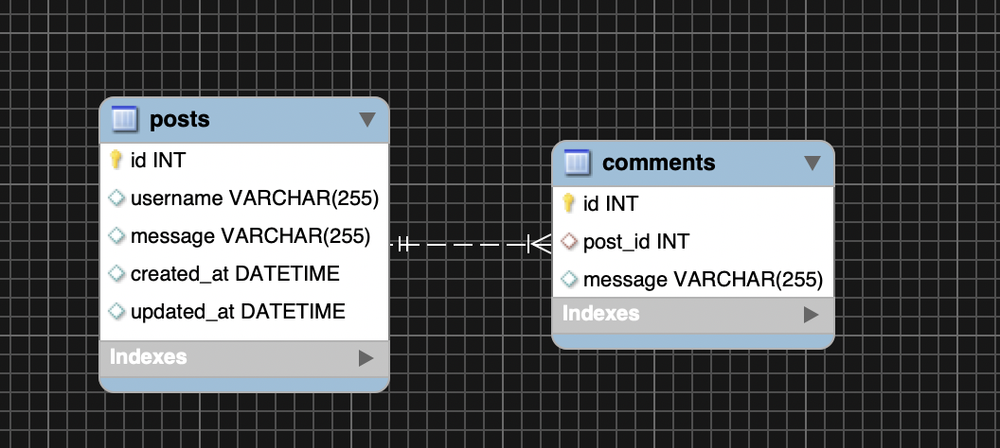
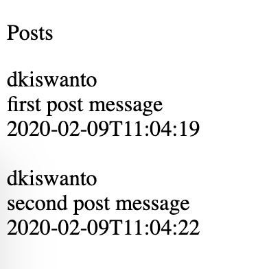

# Rapid Web Development with Rails 6
Dede Kiswanto, "Digital Product Engineer"

<p></p>

  github.com/kinto-d
  linkedin.com/in/dkiswanto


----

# Hello friends!
* <ins> My name is Dede Kiswanto </ins>
* IF 2014 Telkom University
* Cofounder @pesanmang.com (exit 😢)
* Former tech-lead @go.selena.id (exit 😢)
* Finalist Microsoft Imagine Cup 2016 National Final
* Tech-lead @ekuitas.id
* **Product Engineer @studiplex.com**

---

## Why we need to build it fast?, even for student?
* for competition.
* product mvp or prototyping.
* or maybe just tight dedline project.

---

## But why Rails?? What is the benefits??
* Great Community (a lot of libraries a.k.a `gems`, examples, and tutorials, etc)
* One single package (active_record, active_storage, actionmailer, activejob, etc)
** https://github.com/rails/rails
* Convention over configuration
** fixed design pattern
** code generators

---

### Code Generators Example


---

### Code Generators Example (2)


---

## Who's using it?

<div style="margin-top: 200px"></div>


## and many more...

---

## Any Questions?

---


## Lets start, then!
```
http://installrails.com/steps/choose_os
```

---

## Pre-requisites

<!-- _class: small -->
```bash
➜ ruby -v
ruby 2.6.3p62 (2019-04-16 revision 67580) [x86_64-darwin18]

➜ gem -v
3.0.6

➜ bundler -v
Bundler version 2.0.2

# mysql or postgresql server in your local machine,
# or we can just use sqlite for default

➜ rails -v
Rails 6.0.0

➜ yarn -v or npm -v
1.16.0 / 6.9.0
```

---

# Create new project
```
$ rails new instantfame
$ cd instantfame
$ bundle install
```
##### ps: don't forget to commit initial project

---

```sh
$ rails server
```


---

But, lets start with Basic Ruby first

[Basic Ruby](./basic-ruby.md)

---

### Hey now, i know some basic ruby, let's make something awesome then

#### InstantFame
* User authentication (registration)
* Create new Post
* Post timetline
* Comment feature
* Deploy to Production!! (via Heroku)

---


### MVC Overview


---

### Ruby / Rails - the Routes


```rb
# config/routes.rb
Rails.application.routes.draw do
  get  '/posts',     to: 'posts#index',  as: :posts
  post '/posts',     to: 'posts#create', as: nil
  get  '/posts/new', to: 'posts#new',    as: :new_post
  get  '/posts/:id', to: 'posts#show',   as: :post

  # it will generate url_helper such as:
  # posts_url    -> http://localhost:5000/posts
  # post_url(:id) -> http://localhost:5000/posts/:id
  # new_activity_url  -> http://localhost:5000/posts/new
end
```

---

### Ruby / Rails - the Controller

<!-- _class: small -->
```rb
# instantfame/app/controllers/post_controller.rb

class PostController < ApplicationController
  before_action :authenticate_user!, only: %i[create]
  before_action :set_post, only: %i[show]

  def index
    # mighty active_record with gem https://github.com/kaminari/kaminari
    # select * from activites offset 25 limit 50 (default per_page config is 25)
    @activities = Activity.page(2)
  end

  def show
    # hey we didn't do anything here...
    # implicitly render `app/views/post/show.html.erb`
  end

  def create
    ...
  end

  private

  def set_activity
    # instance variable will automaticaly exposed to the view
    @activity = Activity.find(params[:id])
  end
end
```

---

### Ruby / Rails - the Model
```rb
class Post < ApplicationRecord
  belongs_to :user

  has_many :comments
  validates :text, length: { minimum: 10, maximum: 1000 }
end
```

---

### Ruby / Rails - the View (template)
```erb
<!DOCTYPE html>
<html>
  <head>
    <title>Instantfame</title>
    <%= csrf_meta_tags %>
    <%= csp_meta_tag %>

    <%= stylesheet_link_tag 'application', media: 'all', 'data-turbolinks-track': 'reload' %>
    <%= javascript_pack_tag 'application', 'data-turbolinks-track': 'reload' %>
  </head>

  <body>
    <%= yield %>
  </body>
</html>
```

---

### Ruby / Rails - the View (view model)

<!-- _class: small -->

```erb
<div class="container">
  <h4 class="mt-4 text-center font-weight-bold">InstantFame Posts</h4>
  <div class="row">
    <% @posts.each do |post| %>
      <div class="col">
        <div class="card mt-4">
          <div class="card-header">
            <strong>
              <%= post.name %>
            </strong>
          </div>
          <div class="card-body">
            <%= post.description %>
          </div>
        </div>
      </div>
    <% end %>
  </div>
</div>
```

---

### Schema


---

**Base MVC**

<!-- _class: small -->
```rb
Rails.application.routes.draw do
  get  '/posts', to: 'posts#index', as: :posts
end
```

<!-- _class: small -->
```rb
class PostsController < ApplicationController
  def index
    @posts = Post.all
  end
end
```

<!-- _class: small -->
```rb
# $ rails g model Post username:string message:string
class Post < ApplicationRecord
end
```

<!-- _class: small -->
```rb
<p>Posts</p>
<% @posts.each do |p| %>
  <%= p.username %><br>
  <%= p.message %><br>
  <%= p.created_at.strftime('%FT%T') %><br><br>
<% end %>
```

---

### Seed Data
```rb
# bundle exex rails c
Post.create!(username: "dkiswanto", message: "first post message")
Post.create!(username: "dkiswanto", message: "second post message")
```


